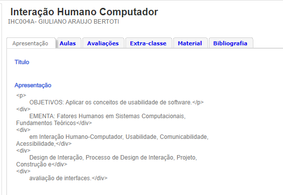
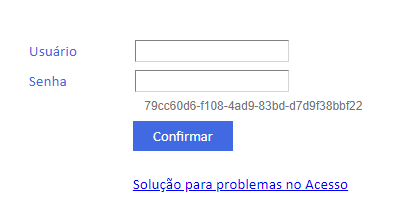
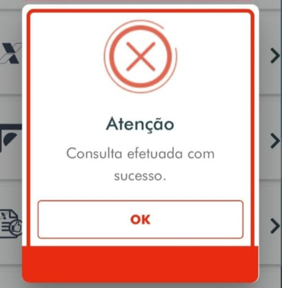
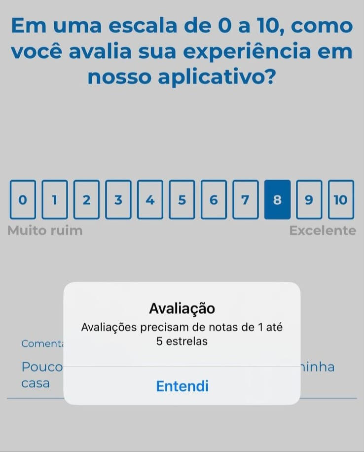
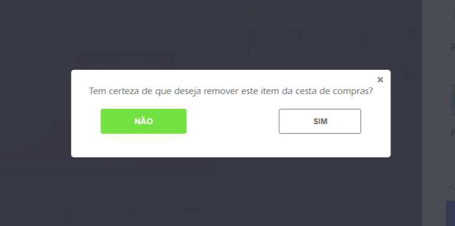
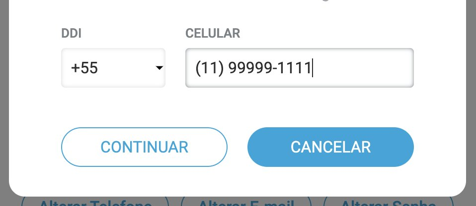
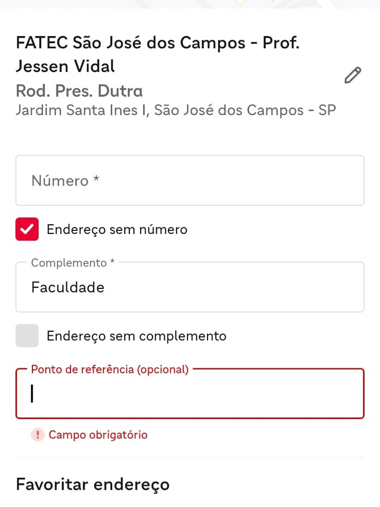
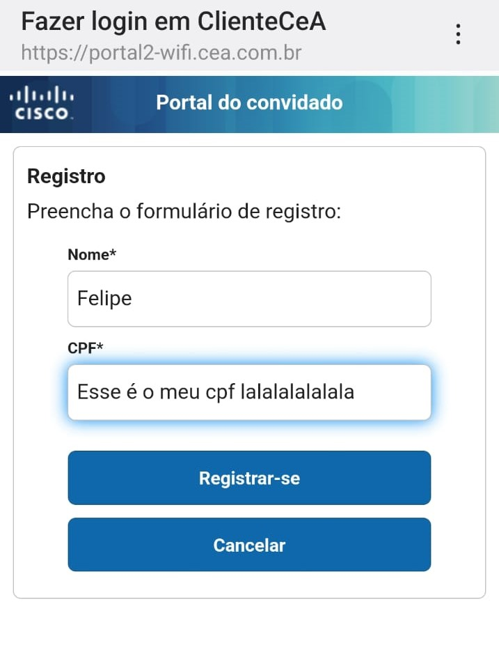
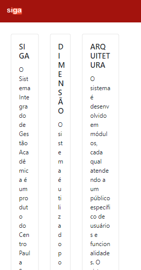
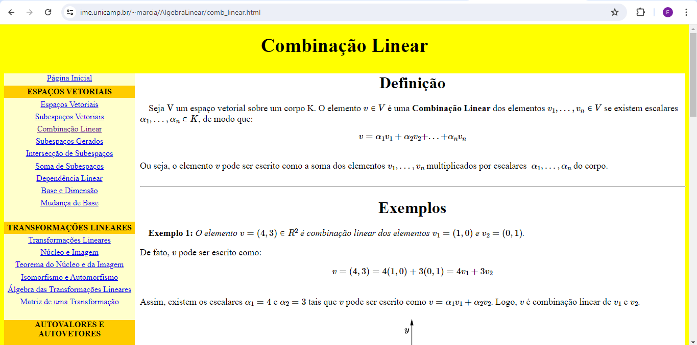

 
<h2> 📱 As 10 Heurísticas de Nielsen na UI/UX - Felipe Gabriel Vieira</h2>

<h3> As heurísticas de Nielsen são um conjunto de dez princípios gerais de usabilidade, desenvolvidos por Jakob Nielsen, que servem como diretrizes para avaliar e identificar melhorias em uma interface de usuário de sites e aplicativos.
Elas são projetadas para ajudar designers e desenvolvedores a criar produtos que sejam mais intuitivos, eficientes e agradáveis aos seus usuários. </h3>

<h2> 🚩 Foram identificados alguns pontos negativos em interfaces nas seguintes heurísticas: </h2>
<h3> 2 - Compatibilidade entre o sistema e o mundo real </h3>

<h4> Uma interface deve apresentar uma linguagem familiar e de fácil compreensão do usuário, o que não foi apresentado nos seguintes exemplos: </h4>

<h3> 😵 SIGA (Sistema Integrado de Gestão Acadêmica) </h5>

<h4> A interface não obede a heurística ao exibir trechos de códigos HTML na apresentação da disciplina, o que não é comum no dia a dia do usuário. </h4>

<h3> 😵 SIGA (Sistema Integrado de Gestão Acadêmica) - denovo</h5>

<h4> Ao esquecer de preencher um Usuário e Senha nos campos de login, o sistema exibe um código misterioso para tentar informar o usuário que seu login não foi concluído. </h4>

<h3> 🍫 Cacau Show </h3>

<h4> Todos os produtos vem acompanhado de um preço exclusivo para "Cacau Lovers", mas o site não conta ao usuário que se trata de um programa fidelidade, podendo deixar o mesmo confuso, pensando que este preço pode depender de alguma assinatura paga. </h4>

<h3> 4 - Consistencia e Padronização </h3>
<h4> É essencial que uma interface ofereça ao usuário uma interação consiste e padronizada em suas telas, para não causar confusões durante o seu uso, o que não foi apresentado nos seguintes exemplos: </h4>

<h3> 😵 SIGA (Sistema Integrado de Gestão Acadêmica) - mais uma vez</h3>
 
<h4> Em um carrosel de imagens, alguns possuem um link para o conteúdo da imagem, outros não, demostrando uma inconsistência entre os itens. </h4>

<h3> 💸 Caixa Econômica Federal </h3>

<h4> Ao efetuar uma consulta de boletos, caso o usuário não possua nenhum boleto em aberto, o sistema exibe uma mensagem vermelha e com um icone de "X", acompanhado de um "Consulta efetuada com sucesso", o que pode levar o usuário a uma grande confusão, já que a interface mostra elementos que trazem significados opostos.</h4>

 
<h3> 💸 Caixa Econômica Federal </h3>

<h4> O usuário recebe uma pesquisa de satisfação com o aplicativo em uma escala de 0 a 10 pontos, mas ao tentar enviar, o sistema aceita somente avaliações entre 1 e 5 estrelas, apresentando uma clara despadronização de sua própria escala de avaliação. </h4>

<h3> 💊 Drogasil </h3>

<h4> Ao tentar remover o item de um carrinho de compras, a interface solicita uma confirmação ao usuário, porém, apresenta a opção "Não", com uma cor verde, cor geralmente associada a ações positivas, por exemplo, na <a herf="https://revistagalileu.globo.com/Tecnologia/noticia/2020/01/por-que-o-semaforo-e-verde-amarelo-e-vermelho.html"> Metáfora do Semáfaro</a>.</h4>

<h3> 🎟️ Ingresse </h3>

<h4> No final de um formulário, a interface exibe um botão "Confirmar", uma ação principal geralmente posicionada à direita e "Cancelar", uma ação secundária à esquerda, no entanto, a mesma ordena os botões de forma inversa do convencional, podendo causar uma confusão no usuário durante o uso. </h4>

<h3> 🍔 Ifood </h3>

<h4> Em um menu para inserir as informações de um endereço, a interface apresenta um campo "Ponto de Referência" como opcional, mas na verdade, ao tentar enviar as informações, o usuário descobre que o campo na verdade é obrigatório, trazendo uma grande inconsistência e confusão durante o uso. </h4>

<h3> 5 - Prevenção de erros </h3>
<h4> Uma interface deve evitar que seus usuários cometam erros em sua plataforma devido a uma interpretação equivocada do seu uso, o que não foi apresentado nos seguintes exemplos:</h4>

<h3> 💸 Caixa Econômica Federal </h3>

<h4> A interface apresenta um formulário de avaliação da experiência do usuário no aplicativo, porém 6 das 11 opções suregidas pela aplicação não são validas para o envio do mesmo, induzindo o usuário ao erro e frustração por não conseguir enviar. </h4>
<h5> P.S: Depois dessa eu até diminuiria a minha nota da avaliação. </h5>

<h3> 🍔 Ifood </h3>

<h4> Em um menu para inserir as informações de um endereço, a interface apresenta um campo "Ponto de Referência" erroneamente marcado como "Opcional", podendo induzir o usuário a um erro ao tentar enviar as informações sem preencher tal campo, já que o mesmo desde o início era obrigatório. </h4>

<h3> 🖥️ Cisco (Soluções em Rede Wifi) </h3>

<h4> Em um formulário de registro, o sistema permite que o cliente insira qualquer tipo de valor em um campo de CPF, sem nenhuma verificação ou aviso, apenas cadastra o texto inserido e libera o acesso do cliente. </h4>

<h3> 7 - Eficiência e Flexibilidade de uso </h3>
<h4> A interface ideal deve apresentar uma inclusão para todo usuários sejam eles leigos ou experientes, todo tipo dispositivo, como um notebook, um tablet ou um celular. O que não foi apresentado nos seguintes exemplos: </h4>

<h3> 😵 SIGA (Sistema Integrado de Gestão Acadêmica) - ele denovo</h3>

<h4> Ao tentar abrir o site em um dispositivo móvel, os textos se apresentam de uma forma no mínimo peculiar, dificultando consideravelmente a leitura do trecho. </h4>

<h3> 🗞️ Jornal de USP </h3>

<h4> A interface acabou apresentando uma formatação de texto bem estreita com o nome da professora, dificultando consideravelmente a leitura do trecho. </h4>

<h3> 8 - Estética e Design Minimalista </h3>
<h4> Uma interface deve transmitar as informações que o usuário procura, evitando um excesso de informações e buscando contrastes de cores que favoreçam a leitura do usuário, o que não foi apresentado no seguinte exemplo: </h4>

<h3> ➗ IME - Unicamp</h3>

<h4> Os sites apresentam cores bem fortes e brilhantes, que podem atrapalhar a leitura do menu lateral e seus indices em algumas páginas. O menu lateral está extremamente sobrecarregado de link e opções que sobrecarregam também o próprio usuário da interface </h4>

<h2> Estes foram os pontos negativos encontrados, Obrigado pela atenção! :) </h2>

    “Even the best designers produce successful products only if their designs solve the right problems. A wonderful interface to the wrong features will fail.” – Jakob Nielsen